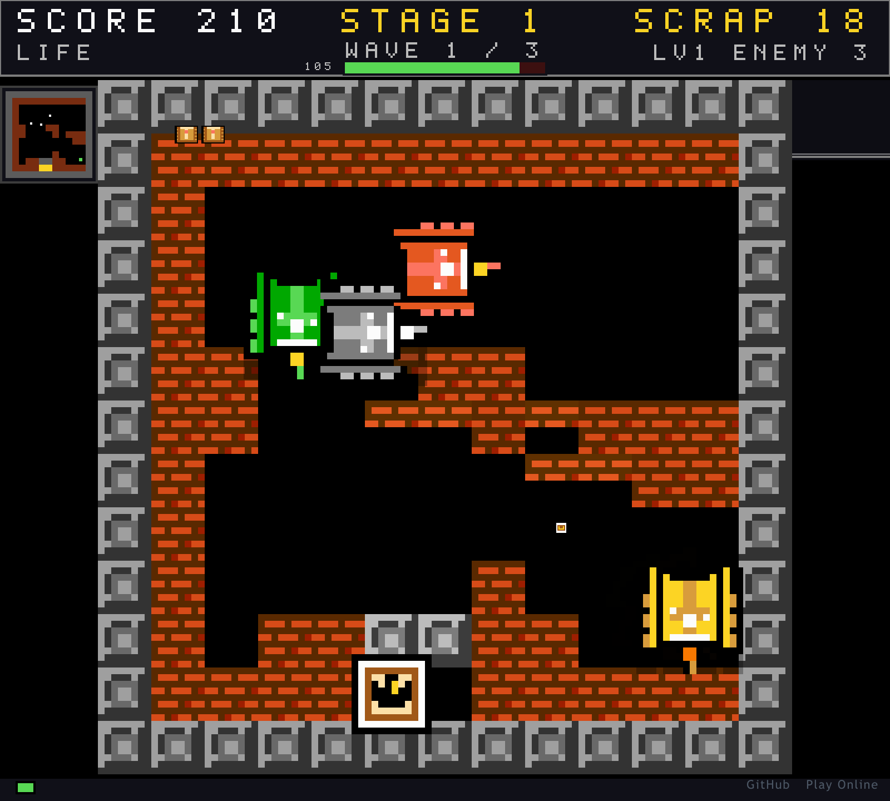

# 铁甲回廊 · Iron Corridor

**坦克大战 × Roguelike** — 一款在浏览器里直接运行的 FC 风格俯视角坦克对战游戏。



## 在线试玩

**GitHub Pages：** https://holynova.github.io/iron-corridor/

手机扫码直接访问：


**源码仓库：** https://github.com/holynova/iron-corridor

## 玩法

程序化生成的单屏回廊，每层 3 波敌对装甲，每 5 层出现 BOSS「钢铁霸主」。
清层与升级都会给出三选一强化（共 25 种，可叠加），击杀掉落废料可在军械库
兑换永久强化。坦克被击毁即本局结束 —— 没有读档。

`WASD` 驾驶 · `鼠标` 独立瞄准 · `点击 / 空格` 开火 · `Shift` 冲刺 · `Esc` 暂停

## 画面

全部像素素材为原创，由 `tools/gensprites.mjs` 以 8×8 / 16×16 原始像素生成：
6 种坦克各 4 向 2 帧履带、地形块、三帧爆炸与 8×8 位图字体。中文界面经过 1-bit
阈值栅格化后整数倍放大，与英文共用同一像素网格。

## 本地运行

```bash
npm install
npm run dev        # http://localhost:5199
npm run build      # 类型检查 + 打包到 dist/
npm run preview    # 预览生产构建
```

技术栈：Phaser 3 + TypeScript + Vite。浏览器需支持 WebGL 与 Web Audio。

## 许可

MIT
