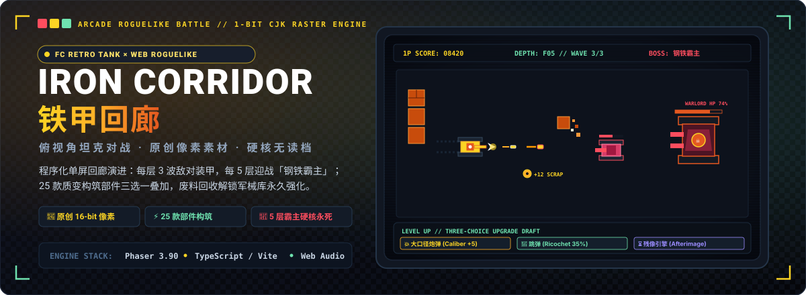

<p align="center">
  
</p>

<p align="center">
  <a href="https://holynova.github.io/iron-corridor/"></a>
  <a href="https://phaser.io/"></a>
  <a href="https://www.typescriptlang.org/"></a>
  <a href="https://vitejs.dev/"></a>
  <a href="LICENSE"></a>
</p>

<p align="center">
  <strong>红白机经典俯视角坦克对战 × 硬核 Roguelike 构筑深度</strong><br>
  原创 16-bit 像素引擎 · 单屏程序化回廊 · 25 种可叠加质变部件 · 五层巨型霸主强袭 · 军械库永久继承 · 硬核永死
</p>

---

## 🕹️ 在线试玩与体验

- **网页端即开即玩**：[https://holynova.github.io/iron-corridor/](https://holynova.github.io/iron-corridor/)
- **手机扫码直接体验**：

<p align="center">
  
</p>

- **项目源码仓库**：[https://github.com/holynova/iron-corridor](https://github.com/holynova/iron-corridor)
- **实机运行截图**：

<p align="center">
  
</p>

---

## 🌟 游戏核心机制

### 1. 经典街机循环与单屏程序化回廊
* **单屏高压战场**：没有多余的大地图跑路，每一层都是程序化生成的单屏战术封闭回廊，砖墙、钢壁与废墟掩体瞬息万变；
* **三波敌军推进**：每层固定迎来 3 波不同兵种搭配的敌对装甲群，必须审慎利用转角掩体与跳弹清剿全场；
* **五层霸主强袭 (Boss Protocols)**：
  * **第 5 层**：初遇巨型首领「钢铁霸主」，拥有 900 HP 巨型装甲、5 连发重型爆弹与强力车体碾压；
  * **第 15 层**：迎战狂暴进阶版「钢铁霸主 II · 重装」，血量与弹速大幅跃迁；
  * **第 25+ 层**：终极防线「终焉协议 · 泰坦」，极速狂暴弹幕地狱；
* **硬核单向历程**：战车生命归零即宣告任务失败，没有中途读档或复活币，每一次出击都是全新的战备考验。

---

## ⚔️ 战备强化与 25 款质变构筑体系

每次清理一波敌军或战车升级时，战场将立即提供**三选一强化部件（Draft System）**。25 种核心升级均支持多层叠加，共划分为 3 大维度与 4 级稀有度：

### 1. 基础属性强化 (Stat Mods)
* `大口径炮弹` (Caliber)：炮弹直伤 +5（最高 8 层）；
* `快速装填` (Autoloader)：主炮装填间隔 -9%（最高 8 层）；
* `推进器` (Thruster)：底盘机动速度 +10%（最高 6 层）；
* `焊接装甲` (Welded Hull)：生命上限 +20 并瞬时恢复 20 点（最高 8 层）；
* `膛线加速` (Rifling)：弹丸出膛初速 +15%（最高 5 层）；
* `纳米修复` (Nanorepair · 稀有)：常驻被动每秒自我修复 0.7 点装甲（最高 6 层）；
* `拾荒者` (Salvager)：掉落废料收益 +35%（最高 5 层）。

### 2. 武器质变改装 (Weapon Mods)
* 🔱 `分裂炮管` (Split Barrel · 稀有)：每次射击额外增发 1 枚并行炮弹；
* 🗡 `穿甲弹` (AP Shell · 稀有)：炮弹击穿目标并可多贯穿 1 个敌坦；
* 💣 `高爆弹` (HE Shell · 史诗)：命中引发剧烈爆炸，附加范围伤害；
* 🏓 `跳弹` (Ricochet · 史诗)：炮弹碰撞墙体获得 35% 物理反弹机能；
* 🎯 `追踪弹头` (Seeker · 史诗)：发射具备向心制导的追踪巡航弹丸；
* 🔺 `弱点分析` / `穿甲弱点`：大幅提升暴击几率（+9%）与暴击爆头倍率（+0.5x）。

### 3. 战术异能与天赋 (Tactical Traits)
* 🛫 `双段推进` (Twin Thrusters · 史诗)：战术冲刺可用充能次数 +1；
* 🌀 `相位护盾` (Phase Shield · 稀有)：冲刺期间无敌帧延长 +0.18s；
* 🩸 `虹吸涂层` (Siphon Coat · 史诗)：击毁敌坦有 22% 几率吸血恢复 2 点生命；
* 🔥 `背水一战` (Overdrive · 史诗)：装甲生命低于 40% 时激发过载装填速度 +22%；
* 🪨 `履带碾压` (Tread Crusher · 史诗)：车身周围产生强力立场，减速敌群 22%；
* ⏳ `残像引擎` (Afterimage · 传说)：击杀时触发时空凝滞（时间流速大幅减慢 1.4s）；
* ⛓ `连锁反应` (Chain Reaction · 传说)：触发暴击击杀时向周围敌人爆射 60% 连锁殉爆伤害。

---

## 🛡️ 敌军装甲图鉴 (Enemy Encyclopedia)

敌方载具严格沿用经典控制台轮廓分级，通过剪影与涂装即可瞬间预判其战斗行为：

| 敌军代号 | 经典车体外形 | 核心威胁与战斗 AI | 弹道特性 |
| :--- | :---: | :--- | :--- |
| **侦察兵 (Scout)** | 基础灰色底盘 | 高机动迂回穿插，寻找死角游击偷袭 | 单发中速穿甲弹 |
| **炮手 (Gunner)** | 绿色强化底盘 | 中距离保持交火线，实施 3 连发压制射击 | 3 连发黄色高爆弹 |
| **重装 (Heavy)** | 粉色厚重装甲 | 高达 130 HP，带头直冲掩体，近距离撞击重创 | 2 连发重型穿甲弹 |
| **狙击手 (Sniper)** | 白色疾速底盘 | 远距离定点狙杀，弹速极快（700 px/s） | 单发超高速贯穿弹 |
| **冲锋者 (Charger)** | 橙色突击底盘 | 210 px/s 疯狗式近身冲撞，极度危险 | 2 连发射击伴随撞击 |
| **蜂群 (Swarmer)** | 超轻型底盘 | 成群结队蜂拥而至，分散玩家注意力 | 短间距骚扰弹 |
| **固定炮台 (Turret)** | 重型防御工事 | 无法移动但拥有 96 HP 与 4 连发环形阻击 | 密集 4 连发弹道网 |
| **钢铁霸主 (Boss)** | 巨型特制底盘 | 900+ HP，全图追猎，5 连发重弹与致命车体碾轧 | 巨型高爆火球弹道 |

---

## 🕹️ 键位与操作指南

| 动作指令 | 键鼠操作 | 说明 |
| :--- | :--- | :--- |
| **驾驶底盘移动** | **W / A / S / D** 或 **方向键** | 四向平滑机动，受车体碰撞物理约束 |
| **火控炮塔瞄准** | **鼠标光标移动** | 炮塔独立于底盘朝向 360° 灵活瞄准 |
| **主炮开火** | **鼠标左键** 或 **空格键 (Space)** | 倾泻主炮弹药 |
| **战术喷射冲刺** | **Shift 键** | 瞬间爆发推进，附带专属无敌帧闪避弹幕 |
| **战术暂停** | **Esc 键** | 呼出游戏菜单与当前战备配置详情 |

---

## 🎨 纯手工 16-bit 像素渲染管线

* **原创点阵资产**：全游戏所有素材均非外部盗用素材，而是由项目自带的脚本 `tools/gensprites.mjs` 在内存中以 `8×8` 与 `16×16` 原始像素网格直接生成；
* **高质感帧动画**：6 种坦克各具 4 向 2 帧动态履带驱动链节、多层次爆炸破片与地形瓦片；
* **1-bit 阈值中文字库 (PixelCjk)**：中文 UI 经过专用算法执行 1-bit 阈值栅格化与整数倍抗锯齿平移，与英文 8×8 点阵完美共用同一像素网格，保留原汁原味街机 CRT 质感。

---

## 📂 项目结构

```text
iron-corridor/
├── assets/
│   └── readme/
│       └── hero.svg           # 项目原生纯矢量 1200x440 CRT 复古题图
├── docs/                      # 实机截图与手机试玩二维码
│   ├── qr.png
│   └── screenshot.png
├── tools/
│   └── gensprites.mjs         # 8×8 / 16×16 原始像素点阵生成器
├── src/
│   ├── core/                  # Web Audio 音效合成、RNG 种子与游戏常数
│   │   ├── audio.ts
│   │   ├── constants.ts
│   │   └── rng.ts
│   ├── data/                  # 敌人属性表、25 款部件定义与字库映射
│   │   ├── enemies.ts
│   │   └── upgrades.ts
│   ├── entities/              # 玩家战车、敌方装甲群、弹丸与掉落废料
│   │   ├── Bullet.ts
│   │   ├── Enemy.ts
│   │   ├── Pickup.ts
│   │   └── Player.ts
│   ├── scenes/                # Phaser 场景管理器（启动、主菜单、战斗、三选一、结算）
│   │   ├── BootScene.ts
│   │   ├── DraftScene.ts
│   │   ├── GameOverScene.ts
│   │   ├── GameScene.ts
│   │   └── MenuScene.ts
│   ├── systems/               # 竞技场生成、寻路流场 (Flowfield) 与碰撞判定
│   │   ├── RunState.ts
│   │   ├── arena.ts
│   │   ├── collision.ts
│   │   └── flowfield.ts
│   ├── ui/                    # 点阵字体、HUD 状态栏与稀有度徽章
│   │   ├── Hud.ts
│   │   ├── PixelCjk.ts
│   │   └── rarity.ts
│   └── main.ts                # Phaser 游戏引擎实例初始化
├── package.json               # 项目依赖与运行脚本
├── tsconfig.json              # TypeScript 编译配置
└── vite.config.ts             # Vite 构建与部署配置
```

---

## 🛠️ 本地运行与快速上手

游戏基于 **Phaser 3 + TypeScript + Vite** 开发，运行环境需要现代支持 WebGL 与 Web Audio 的浏览器：

```bash
# 1. 克隆代码仓库
git clone https://github.com/holynova/iron-corridor.git
cd iron-corridor

# 2. 安装项目依赖
npm install

# 3. 启动本地热重载开发服务器（默认端口 5199）
npm run dev

# 4. 执行类型检查并打包生产构建
npm run build

# 5. 本地预览打包产物
npm run preview
```

---

## 📜 开源协议

本项目基于 [MIT License](LICENSE) 开源。欢迎 Star、Fork 或提交改进建议！
